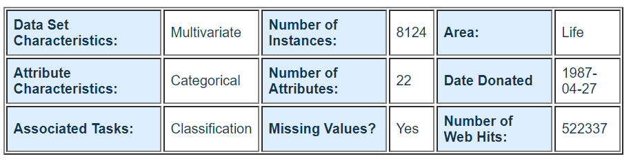

# Data analysis on wine data and mushroom data

## Contents
* About Project
* Motivation
* About the Data set
* Results
* Tech/framework used

&nbsp;

## About Project
Conducted analysis on mushroom and wine data. Applied decision tree algorithm, logistic algorithm and MLP on both mushroom and wine data. Retrieved cross validation accuracy of each model.

&nbsp;

## Motivation
School machine learning project.

&nbsp;

## About the Data set

**mushroom Data**
reference : [UCI Mushroom data](http://archive.ics.uci.edu/ml/datasets/Mushroom)

**wine data**
Created own wine data set. The number of instances are 6498 and there are 13 different attributes.

|attribute name|attribute explanation|
|------|---|
types|와인 종류
Fixed acidity	|고정산
Volatile acidity|	휘발성산
Citric acid	|시트르산
Residual sugar	|잔당
Chlorides	|염화물
Free sulfulr dioxide	|황 화학물
Total sulfur dioxide|	황 화학물
Density	|밀도
PH|	산성도
Sulphates|	황산염
Alocohol|	도수
Quality|	품질

## Results
Following pictures are cross validation results of  decision tree, logistic, mlp models applied to each mushroom data and wine data.

#### mushroom data
__decision tree__

__logistic tree__

__mlp__

#### wine data
__decision tree__

__logistic tree__

__mlp__

## Tech/framework used
<b>Built with</b>
- Jupyter notebook

&nbsp;
